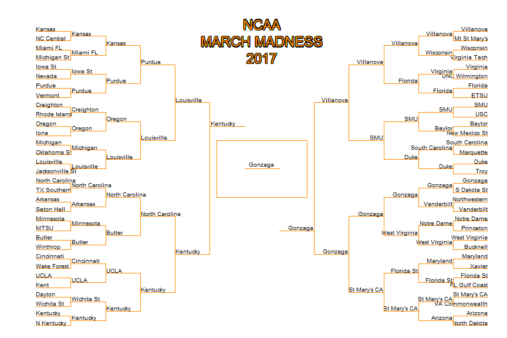

### From March Apathy to March Madness

???

### Calculate NCAA Rankings

I used R, a preferred language for data scientists, to write a function that will calculate NCAA basketball team rankings using the Massey Method as explained by Professor Chartier. This algorithm follows this general recipe for calculating the rankings using a linear system:

1) Calculate each team's net point spread from the regular season games and save these in a vector (V).
2) Calculate a winning team by losing team matrix (M) that has the amount of games each team has played as well as a multiple of -1 for each matchup between the same two teams.
3) Solve the equation M * Rankings = V, where the teams in V are aligned with the teams in the rows of M.
4) Calculate the inverse of M.
5) Multiply the inverse of M by V to get the rankings.

For a more in depth understanding of the mathematical ideas behind this algorithm I suggest acquiring Professor Chartier's lectures on *Big Data* from The Great Courses.

The R function below may not be too pretty, but it gets the jobs done and returns a list of rankings. There are various parameters that can be passed to the function. These parameters include the year to calculate the rankings for, a cap for each games point spread, a weight for away games, and weights for games in played in different quarters of the season. There is also a parameter that will allow me to set a number of randomly chosen upsets in round 2, such that a losing team by ranking would still win that game. The allows for new rankings to be calculated very quickly under different scenarios.


### Simulate March Madness

This next chunk of code simulates the March Madness tournament, starting with 64 teams and simulating matchups in each subsequent round until there is one champion. The outcomes of the games are determined by the rankings that we calculated previously, such that for each matchup the team with the higher ranking is presumed to win.  


```r
#set file paths
fp <- "C:/March Madness/Data/mens-machine-learning-competition-2018/DataFiles/"
fp.RegularSeasonCompactResults <- paste(fp, "RegularSeasonCompactResults.csv", sep="")
fp.Teams <- paste(fp, "Teams.csv", sep="")
fp.seeds <- paste(fp, "NCAATourneySeeds.csv", sep="")
fp.slots <- paste(fp, "NCAATourneySlots.csv", sep="")

# load files into data frames
df.RegularSeasonCompactResults <- read.csv(fp.RegularSeasonCompactResults)
df.Teams <- read.csv(fp.Teams)
df.seeds <- read.csv(fp.seeds)
df.slots <- read.csv(fp.slots)
```


```r
# set parameters
parYear <- 2017
parScoreCap <- 100
parLocMod <- 2
parQ1Mod <- 1
parQ2Mod <- 1
parQ3Mod <- 1
parQ4Mod <- 1
parUpsets <- 0

# get the rankings
ranks <- GetNCAARankings(df.RegularSeasonCompactResults, df.Teams, parYear, parScoreCap, parLocMod, 
                           parQ1Mod, parQ2Mod, parQ3Mod, parQ4Mod)
# run the simulation
sim <- SimulateMarchMadness(df.seeds, df.slots, ranks, parYear, parUpsets)

# create the bracket visual
MarchMadnessBracket(sim, parYear)
```

<!-- -->

